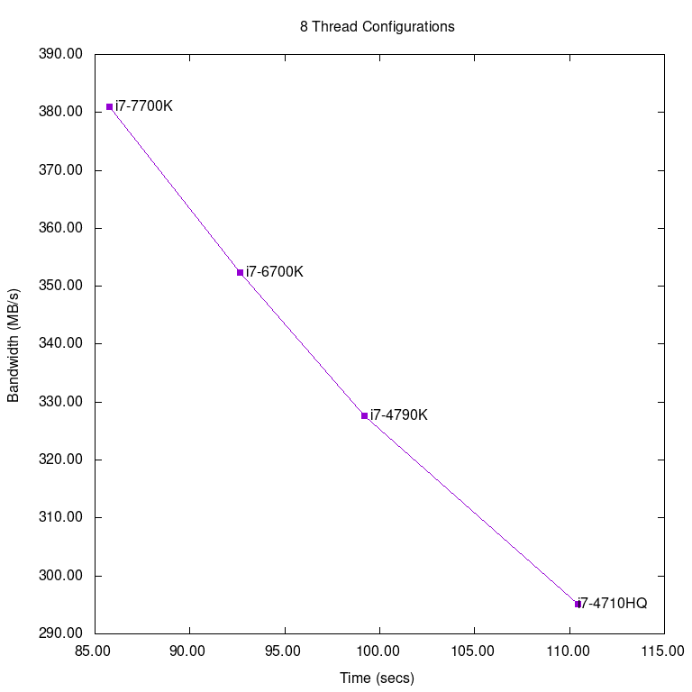

# Measure cross CPU memory performance



## Dependencies

The following tool shells out to a few commands to query certain pieces
of information, in particular you'll need the following shell commands
installed or present.

* lscpu (in particular one which supports `--parse=OPTIONS`)
* grep (any will do)
* uniq (any will do)
* sed (any will do)
* cut (any will do)
* curl (this is optional and is only needed for `-s` or `--share`)

## Options

```
usage: ./xcpumemperf [options]
options:
  -h, --help            print this help message
  -T, --threads=COUNT   the amount of thread pairs to use per trial run
  -m, --memory=MB       the amount of memory to work on in MiB
  -t, --trials=COUNT    the amount of trials to run for benchmark
  -F, --force-same-cpu  forces read and write pairs to end up on the same CPU
  -s, --share           share results by posting output to sprunge
  -p, --populate        populate shared memory mapping before benching
  -H, --hugepage=DIR    create a huge page using this directory (must be a hugepages mountpoint)
```

## Rationale

This was written to show a pathological case with Ryzen where this
test escapes Ryzens typical dual page walker hardware and cache utag
mechanism.

Software Optimization Guide for AMD Family 17h Processors section 2.7.3
states:

> Linear aliasing occurs when two different linear addresses are
> mapped to the same physical address.  This can cause performance penalties
> for loads and stores to the aliased cachelines.  A load to an address
> that is valid in the L1 DC but under a different linear alias will see
> an L1 DC miss, which requires an L2 cache request to be made.  The
> latency will generally be no larger than that of an L2 cache hit.
> However, if multiple aliased loads or stores are in-flight simultaneously,
> they each may experience L1 DC misses as they update the utag with a
> particular linear address and remove another linear address from being
> able to access the cacheline.

In particular, this hits the latter case, a full L1 DC miss which then
becomes a full 8-way lookup. In particular, if the physical tag is
wrong, then it cannot look in the set since the set is virtual.

In general, CPUs cannot afford to translate linear addresses to physical
ones, then look it up in L1, so they optimistically lookup by virtual address
instead and make sure later (after the address translation is done
concurrently) that the physical tag in the cache matches the TLB lookup.
When you create an alias (two or more linear addresses which map to the
same physical page(s), you cause this mismatch to happen.)

When these mismatches occur the CPU has to do a full page walk, and this
is where Ryzen's dual page walk hardware causes a pathological
performance issue, in particular, the dual page walker hardware is
required to behave atomically since two threads (on the same core)
are allowed to translate addresses concurrently, however this is only
on a per-core basis. When you split up the walks across two (or more)
physical cores the walking hardware serializes. This is because only
one dual page walking assist exists. On other x86 systems there exists
page walking hardware for each physical core.

One should question why Ryzen has only one assist for this when page
walking is trivial to do on x86 (you chase at most 4 physical addresses.)
and the reason for this is because each assist needs a cache of page
table entries at L1 DC and Ryzen chose to avoid wasting L1 DC. This
decision makes sense since cost of cache in terms of die area and wires
is exceptionally high as is and having to duplicate that for all
the physical cores would drive the cost and power consumption of Ryzen
up. You can afford to make that design decision when you have fewer
cores, but alas that's not the case with something like the 1950x.

## Algorithm

The way this measures performance across CPUs is via the use of
explicit shared memory mappings to ensure that each CPU gets it's
own virtual mapping. The read end only gets read permissions while the
write end only gets write permissions. This ensures separate page table
entries.

This was written with standard UNIX in mind so it uses a socket to
hand over the shared memory file descriptor through the use of `sendmsg`
opposed to just sending the file descriptor over directly which would
work okay in Linux but no where else.

The approach here uses a block of shared memory mapped in a read process
and a write process constructed by this process. This memory is touched
completely from beginning to end with simple load/store in each process.
The size of the block of memory can be configured with the `MEMORY` macro.

The entire process is done multiple times as to reduce scheduling noise
and thread construction cost, this is configured with the `TRIALS` macro.
The time is averaged at the end to provide a stablized result. Note:
all time is measured in wall clock time and not CPU time as we also
want to consider the cost of blocking operations like swap
